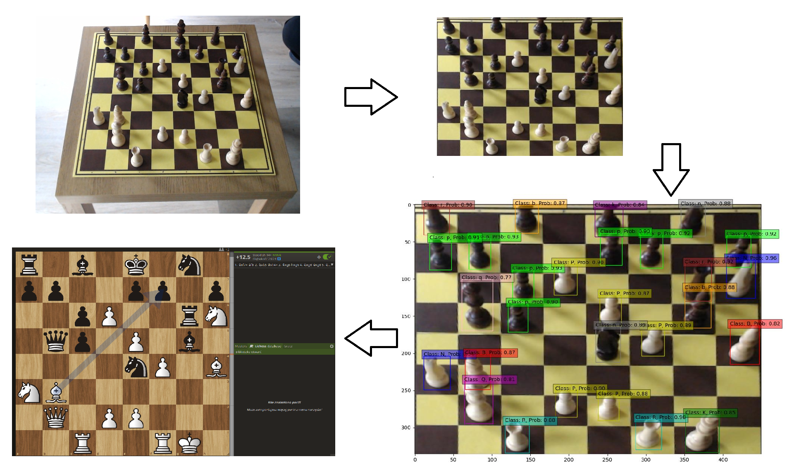

# Chess Vision

## Overview

Chess Vision is an innovative project designed to recognize and analyze chess boards and pieces through images. Utilizing machine learning models, the system can accurately identify the positions of chess pieces on a board and translate this data into Forsyth-Edwards Notation (FEN). This FEN can subsequently be used for in-depth position analysis on platforms such as Lichess.



## Key Features

- **Corner Detection**: Pinpoints the four corners of a chessboard within an image.
- **Piece Identification**: Recognizes individual chess pieces on the board.
- **FEN Conversion**: Transforms the identified board state into a FEN string.
- **Lichess Compatibility**: Directly opens a Lichess board analysis page using the generated FEN.

## How to Use

### Image to Lichess

This feature allows you to convert an image of a chessboard into a Lichess board analysis link. It performs the following steps:

1. Reads an image of a chessboard.
2. Detects chessboard corners.
3. Using detected corners crops and transforms the image.
4. Detects the pieces present.
5. Converts these detections into FEN format.
6. Opens a Lichess board analysis page using the FEN.

## Configuration Settings

The project employs a configuration file (`config.ini`) to manage global parameters and model paths. The configuration includes:

- **Global Parameters**: Specific settings for each type of chess piece.
- **Model Paths**: Locations of the trained models for corner and piece detection.

## Dependencies

The project relies on the following libraries:

- `ultralytics`
- `IPython`
- `numpy`
- `matplotlib`
- `cv2`
- `shapely`
- `flask`

## Running the Project

To get started, you have multiple options:

### Option 1: Traditional Setup

1. Clone the repository.
2. Install the necessary dependencies.
3. Choose to run either:

    a) The `Project.ipynb` notebook for a visual walkthrough.
    
    b) The `app.py` script to:
    - Access a basic GUI at `http://127.0.0.1:5000`, or
    - Use a bash command for a direct link to the analysis, e.g., `$ curl -X POST -F "file=@examples/example_1.jpg" http://127.0.0.1:5000/get-lichess-link`.

### Option 2: Using Docker

If you prefer to use Docker, a `chess-vision.tar` Docker image file is provided via Google Drive [here](https://drive.google.com/file/d/1ruriP6TBDnJtWdTyYPdeEoU_1vHbWK9m/view).

1. Load the Docker image:  
    ```bash
    docker load -i chess-vision.tar
    ```

2. Run the Docker container:  
    ```bash
    docker run -p 5000:5000 chess-vision
    ```

3. Access the application via your web browser at `http://127.0.0.1:5000` or use the bash command for a direct link to the analysis as mentioned above.
